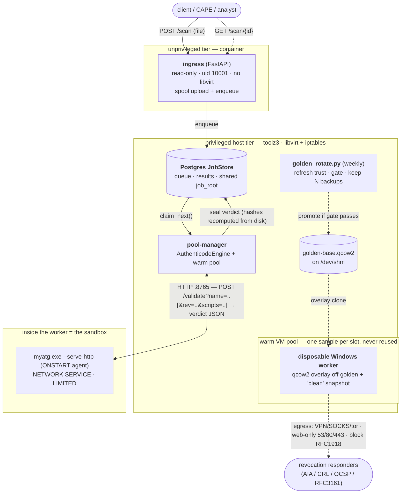
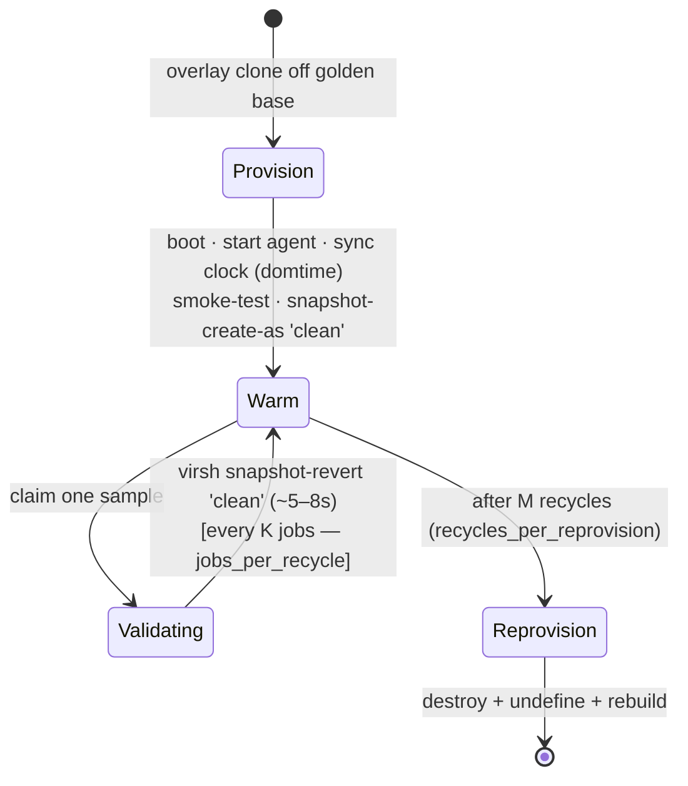

# win-validator

**Windows code-signature validation for untrusted files, run inside disposable KVM Windows
workers** — a [blastbox](https://github.com/wmetcalf/blastbox) engine that wraps the
[myatg](https://github.com/wmetcalf/myatg) Authenticode validator and returns a typed,
host-sealed verdict you can trust.

You hand it a suspect `.exe` / `.dll` / `.msi` / `.cab` / script / `.rdp`; it validates the
signature, certificate chain, timestamp, and a cert-graveyard (known-bad) lookup **on real
Windows** — but never on your host and never in a VM that has seen another sample.

## Where it sits

Three repos, one job each:

| Repo | Role |
|------|------|
| [**blastbox**](https://github.com/wmetcalf/blastbox) | the framework — job store, warm worker pool, disposable **libvirt/KVM VM-per-job** runtime, egress rooter, output-trust sealing. Ships *no* domain engines. |
| [**myatg**](https://github.com/wmetcalf/myatg) | the leaf tool — a self-contained native Windows Authenticode/catalog/script/RDP validator (`myatg.exe`). Runs *inside* the worker. |
| **win-validator** *(this repo)* | the **`authenticode` blastbox engine** + a fan-out orchestrator. Turns "run myatg in a disposable Windows VM" into a blastbox `Engine`, and wires the golden-image build + rolling refresh + least-privilege deployment around it. |

## How it works



1. **ingress** (an unprivileged, read-only container) takes the upload, spools it to a shared
   `job_root`, and enqueues a job in the blastbox **JobStore** (Postgres). It holds no `root`,
   no libvirt socket — a web-stack compromise is contained to that box.
2. The **pool-manager** (host systemd, the only privileged tier) claims the job and runs the
   `authenticode` engine, which hands the file to a **warm Windows worker** from the pool.
3. The worker is a **libvirt qcow2 overlay clone** off the golden base with an internal `clean`
   snapshot. A baked-in guest agent (`myatg.exe`, running as **NETWORK SERVICE, unprivileged**)
   validates the file over an HTTP `POST /validate` call and returns myatg's JSON verdict
   (per-job `?rev=`/`?scripts=` overrides ride along on that request).
4. blastbox **re-seals** that output from disk (recomputing every hash/size, confining paths)
   before a byte of it is trusted, and writes it back as the job result. The client polls
   `GET /scan/{id}`.

Why the worker is a *VM* and not a container like blastbox's other engines: the validator needs
**real Windows** WinVerifyTrust / catalog / X509 semantics, so the disposable unit is a full-OS
libvirt VM and the engine runs **host-side**, driving it over HTTP — the VM *is* the sandbox.

## Disposable workers — the recycle model

A worker handles **one sample per slot and is never reused across samples dirty**. Reset is a fast
in-VM snapshot revert, not a reboot:



- **`snapshot-revert`** restores a warm baseline (agent up, CRL cache primed) in ~5–8 s, wiping any
  per-sample contamination — a parser-exploit blast radius of at most `K` samples in one VM before it
  resets. Real UTC time is re-synced on every restore (`virsh domtime --time`), so a restored worker
  always validates against **now** (validity windows + revocation freshness are trust-critical).
- The base lives on **`/dev/shm`** (RAM), so overlays boot and revert at memory speed and identical
  clone pages dedupe via KSM.

## Rolling golden — freshness, *not* temporal trust

`golden_rotate.py` keeps the golden image **fresh** and keeps the last N as **rollback backups**:

```
build_candidate()  master --overlay--> myatg.exe --refresh
                   (disallowed kill-list + CRL cache + roots/CTL via syncWithWU) --> flatten
validate_golden()  boot a throwaway worker off the candidate
                   GATE:  benign binary == Valid  AND  known-revoked == Revoked
rotate()           back up current golden (keep last N) --> promote candidate --> restart pool-manager
```

> **The hourly/daily/weekly/monthly ladder is a backup rotation, not "validate as-of T."** Workers
> sync real time and do live CRL/OCSP on restore, so they always validate against *now*; the only
> thing an old snapshot freezes is trust-store state, which is a **liability if stale** (you want the
> *freshest* disallowed list). So old goldens are rollback targets for a bad re-bake — nothing more.

A candidate is promoted **only if it passes the gate**, so a wedged Windows-Update re-bake or a
corrupted image is rejected and the current golden is kept.

## Locked-down egress — why it matters here

The worker's network is a **class policy, not a host allowlist**: an anonymizing exit
(VPN/SOCKS, tor optional) + **DNS/HTTP/HTTPS only (53/80/443)** + **block all RFC1918/internal**,
fail-closed on a tunnel drop. This is because signature validation *itself* reaches out — WinVerifyTrust
and X509Chain **fetch attacker-controlled embedded URLs** (AIA / CRL / OCSP / RFC3161 timestamp). So we
anonymize that beacon, protocol-limit it, and block SSRF/lateral movement. An unreachable responder
just yields `revocation_checked="unknown"`.

## Repo layout

```
winval_blastbox/   the authenticode blastbox Engine + host runner + VM pool + FastAPI orchestrator
                   (engine.py · host_runner.py · vm_pool.py · orchestrator.py)
golden-packer/     Packer (QEMU) builder for the WS2025-Core golden qcow2 (provisioners, autounattend)
golden_build.py    reproducible in-guest bake pipeline (ngen · qemu-ga · compile myatg · refresh trust)
golden_rotate.py   rolling freshness re-bake + gate + rollback backups
deploy/            the privilege split — ingress container + host pool-manager + Postgres + systemd units
```

## Quickstart

Full bring-up (the ingress/pool-manager privilege split, the rolling-golden timer) is in
[`deploy/README.md`](deploy/README.md). The single-host orchestrator:

```sh
# on the libvirt host — warms the VM pool at startup
uvicorn winval_blastbox.orchestrator:app --host 127.0.0.1 --port 8099

curl -F file=@suspect.dll 'http://127.0.0.1:8099/scan'   # -> {job_id, status: queued}
curl http://127.0.0.1:8099/scan/<job_id>                 # -> per-engine verdict(s)
```

`GET /cert/{tbs_sha256}` returns every scanned file whose signer or chain carries that cert.

## Status

- **`authenticode` engine + orchestrator: built and validated end-to-end** (engine → myatg VM pool
  → sealed envelope; verdicts match the reference corpus). myatg is baked into the golden (no per-boot
  compile); the disposable-VM primitive is upstreamed into blastbox's `libvirt_vm` runtime.
- **Follow-ups:** plumb per-job params (`--rev`/`--gv`/`--scripts`) through the guest-agent transport;
  parameterize the remaining toolz3-specific paths; the designed **ember-legacy / ember-2024** ML
  engines (the orchestrator already fans out to them and returns per-engine verdicts side-by-side —
  it reports components, not a single opinion).

## Security note

This project exists to handle **untrusted, frequently-malicious files**. It never *executes* a
sample — it only parses signatures (WinVerifyTrust / catalog / SignedCms) — so residual risk is a
signature-*parser* exploit, contained to a throwaway, egress-locked VM that resets every few jobs.
Do not repurpose the workers to detonate samples without revisiting that model. Malware corpora,
VM images, keys, and infra config are excluded from this repo by `.gitignore` — keep them out.
